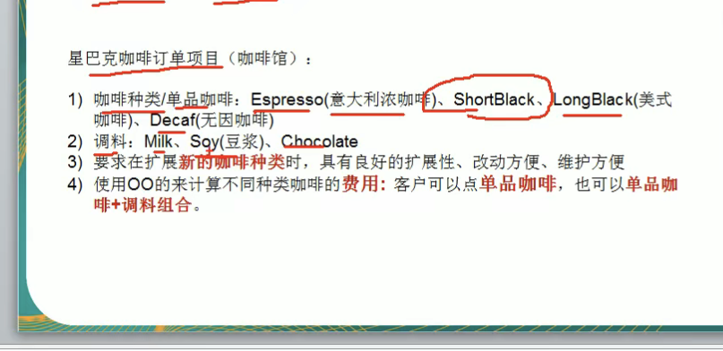

# 23种设计模式
创建型模式 单例模式(一个对象) 工厂模式(抽象工程模式) 建造者模式 原型模式
结构型模式 适配器模式(类似中间件)
行为型模式 策略 观察者模式

# 单例模式
一个类只能有一个实例 并且可以在任意的地方访问到他
比如 Axios单例模式
    任务管理器
    回收站
    网站的计数器
    数据库连接池a

# JAVA设计模式
 - 先来看几个经典的面试题
   - 原型设计模式
   - 有请使用UML类图画出原型模式的核心角色
   - 原型设计模式的深拷贝和浅拷贝是什么? 并且画出深拷贝的两种方式的源码(重写clone方法 实现深拷贝 使用序列化来实现深拷贝)
   - 在Spring框架中 哪里使用了原型模式 并且对源码进行分析
     - beans.xml
     - <bean ud="id01" class="com.xx.spring.Test" scope="prototype" />
# 设计模式的七大原则 是什么 核心思想是什么 
   - 单一职责原则
   - 接口隔离原则
   - 依赖倒转原则
   - 里氏替换原则
   - 开闭原则
   - 迪米特原则
   - 合成复用原则

# 设计模式的重要性
软件工程中 设计模式 是对软件设计中普遍存在的问题 所提出的解决方案 
# 使用了设计模式后的优点
 - 可扩展性
 - 可维护性
 - 可读性
 - 
# 设计模式存在于软件的哪里
 软件体系
 语言 --> 功能模块[设计模式+算法(数据结构)] --> 框架[使用到多种的设计模式] -- > 架构[服务器集群]
 
# 授课方式
 应用场景 --> 设计模式 --> 剖析原理 --> 分析实现步骤 --> 代码实现 --> 框架或者源码分析

# 设计模式的目的
编写程序的过程中 程序员面临来自 耦合性 内聚性 以及可维护性 可扩展性 重用性 灵活性等多方面的挑战 设计模式就是为了解决这些

# 设计 设计模式的七大原则 详解
- 单一职责原则
  - 基本介绍
    - 对类来说的 即一个类 [应该只负责一项职责 例如订单类 就只负责订单的业务代码] 如果A负责两个不同职责 1 2 当职责1 变更需求而改变A时 可能会造成职责2错误 所以一个类就只需要负责一项职责 
    - 比如将A的粒度分解为 A1 A2
  - 应用案例
    - 交通工具的案例 SingleResponsebility类中
      - 有三种方案
        - 第一个类 就没有符合单一职责
        - 第二个类 通过降低类的粒度 来严格的遵守单一职责
        - 第三个类 通过只遵守方法级别的单一职责 
    - 单一职责原则的注意细节
      - 降低类的复杂度 一个类只负责一个职责
      - 提高类的可读性 可维护性
      - 降低变更引起的风险
      - 通常情况下 我们应该遵守单一职责原则 
        - 那些情况可以违背?
          - 只有逻辑足够简单 才可以在代码中违反单一职责原则 只有类中的方法足够少 可以在方法级别符合单一职责原则
- 接口隔离原则
  - 基本介绍
    - 客户端不应该依赖他不需要的接口 即一个类对另一个类的依赖 应该建立到最小的接口上
    - 比如 现在有 A B C D 四个类 并且有一个接口F内部有五个抽象方法
    - 这时 B 和 D 都去实现了这个接口中所有的方法 A这时想通过B使用接口的其中几个方法 但是B里面有接口的所有方法 所以违反了接口隔离原则 C D也是一样
    - 图解 
    - //按照依赖隔离原则 : 将接口拆分粒度 为几个独立的接口 类A 和 类C 分别使用对应的接口 这就是接口隔离
  - UML 图 [B D的线 是实现的意思 A C的线是依赖[通过接口来使用B D类 比如方法的数据类型为接口 但是传入的对象是B 也就是接口的实现类]]
    - 没有遵守的图例 
      - 
    - 遵守的图例
      - 
  - 小总结
    - 类A通过接口依赖B 类C通过接口依赖D 如果接口对于A 和C来说不是最小接口 那么就违背了接口隔离原则 必须要是最小接口单位
    - 客户端不应该依赖他不需要的接口 即一个类对另一个类的依赖应该建立在最小单位的接口上
- 依赖倒转原则 [面向接口编程]
  - 基本介绍
    - 高层的模块不应该依赖底层模块[Person类不能依赖一个微信 短信之类的类 而是应该依赖一个抽象的类 例如 信息(信息就是微信和短信的抽象)] 二者都应该依赖其抽象类[接口]
    - 抽象不应该存在依赖细节 细节应该依赖抽象
    - 依赖倒转的中心思想是面向接口编程 [抽象]
    - 使用接口或者抽象类的目的就是制作规范 而不涉及任何具体的操作 把展现细节的工作交给实现类来实现
  - 实现的方式
    - 通过接口传递来实现依赖
    - 
    - 通过构造方法来依赖传递
    - 
    - 通过setter方法来依赖传递
    - 
    - 使用的方式
    - 
    - 所以依赖倒置的三种方式 有 接口传递 构造函数传毒
  - 小总结
    - 低层模块最好都要有一个抽象类[比如ChangeHongTv SamSungTv AppleTv 这些都可以抽象为 Tv接口] 或者接口 或者两者都有 程序稳定性更好
    - 函数的参数量的声明类型最好是抽象类或者接口 这样我们的变量引用和实际对象之间 就存在一个缓冲层 利于程序的优化和扩展
  - 所以以后的设计应该是
    - 子类 ---实现---> 抽象类/接口 <--依赖/使用---- 功能模块 [功能模块通过使用接口 来使用这个接口的实现类]
- 里氏替换原则 [不要覆盖基类的方法]
  - 基础介绍
    - 为什么会有里氏替换? 他解决了什么问题
    - 面向对象中的继承问题
    - 1 继承包含这样一个含义 父类中凡是已经实现的方法 实际上是在设定规范和契约 虽然他不像接口一样必须要子类遵守 但是如果子类对这些已经实现的方法进行修改 就会对整个继承体系造成破坏
    - 2 继承在给程序设计带来便利时 也带来了弊端 比如使用继承会对程序带来侵入性[移植性降低] 增加对象的耦合度[比如父类如果要修改 要考虑所有的子类 并且修改后 还有可能子类会产生故障]
    - 里氏替换原则就是规定了 如何正确的使用继承关系
  - 里氏替换原则的思想
    - 比如T2继承T1 然后在程序中使用T1时 都可以将T1改为T2使用 并且不受影响 也就是 所有引用父类的地方都必须能够隐式的使用其子类的对象
    - 在使用继承时 一定也要遵循里氏替换原则 尽量子类不要去重写父类方法
    - 里氏替换告诉我们 继承实际上让两个类的耦合性增强了 [在适当的情况下 可以通过聚合 组合 依赖来解决问题]
    - 比如 B extends A 然后 A中有四个方法 但是B重写了A的所有方法 这样看来这个继承就是无意义的继承
  - 如何使用 
    - [使用 组合 聚合 依赖的方法 来避免继承关系]
- 开闭原则 [最重要的一个原则]
  - 基本介绍
    - 是编程中最基础 最重要的设计原则
    - 一个软件实体 如类 模块 函数应该 **对扩展开放[提供方]对修改关闭[使用方]**[即当我们给类增加新功能时 尽量不要修改代码 或者少修改代码] 用抽象实现框架 用实现扩展细节
    - 当软件需要变化时 尽量通过扩展软件实体的行为来实现变化 而不是通过修改已有的代码来实现变化
    - 编程中遵循其他的原则 以及使用设计模式的目的 就是为了遵循开闭原则
    
- 迪米特原则
  - 基本介绍
    - 一个对象一个对其他对象保持最小的了解
    - 类与类的关系越密切 耦合度越大
    - 迪米特法则 又叫最少知道法则 即一个类对自己的1依赖的类知道的越少越好 也就是说 对于被依赖的类不管多么复杂 都尽量封装在一个类中 出了对外的public方法 不泄露任何信息 
    - 迪米特法则还有一个 更简单的定义 只于直接的朋友联系
    - 直接的朋友?
      - 每个对象都会与其他对象有耦合关系 只要两个对象之间有耦合关系 我们就叫这种为朋友对象 耦合的方式有很多 聚合 依赖 组合 关联等 其中 我们称出现成员变量 方法参数 方法返回值中的类 为直接的朋友 
      - 而出现在局部变量中的对象 不是直接的朋友 也就是说 陌生的类 最好不要以局部变量的方式存在
    - 小总结
      - [迪米特法则就是 不要将自己的内部实现方法 写在别的类的内部！！]
      - 迪米特的核心是降低类与类的耦合度 但是不能消除耦合

- 合成复用原则
  - 基本介绍
    - 原则是尽量使用聚合 和 组成 而不是使用继承
    - 图解 

# 设计原则的核心思想
 1 找出应用中可能需要变化的地方 然后独立出来 不要和那些不需要变化的代码混合在一起[开闭原则 扩展开放(提供者) 修改关闭(使用者)]
 2 面向接口编程 而不是面向实现编程
 3 为了交互对象的松耦合设计而努力
 

# UML基本介绍
 - 关系介绍
   - Dependency
     - 依赖 也可以表示使用的意思
   - Association
     - 关联 1:N n:1 1:1 n:n
   - Generalization
     - 泛化 也就是继承
   - Realization 
     - 实现 
   - Aggregation
     - 聚合  例如A类 里面有一个成员变量的数据类型为B类 然后B类的值 是通过一个setter方法 进行赋值的 这时候 就表示A聚合B
   - Composite
     - 组合  例如A类 里面有一个成员变量的数据类型为B类 并且B类的值 直接赋值为 B b = new B(); 这时候就表示 A组合B类 这种耦合性要比聚合高
   

# 依赖 泛化 实现
 - 依赖 [泛化和是实现都是依赖关系]
   - 只要是在类中用到了其他类 那他们之间就存在依赖关系
   - 如 类的成员属性 类的返回值 类的参数类型 方法中使用到[可以是局部变量]
 - 泛化 
   - 也就是继承关系 A泛化B 就是 A继承B
 - 实现关系
   - 也就是一个类实现了接口 那么就是实现关系 A实现了B

# 关联 聚合 组合
 - 关联
   - 关联关系其实就是 类与类的关系 他是依赖关系的特里 关联具有导航型 如双向or单向
   - 关联具有多重型 如 1 表示有且只有一个 0... 表示0或者多个 0,1 表示0或者1个 n..m 表示n到m个都可以 m.. 表示至少m个
   - 
 - 聚合关系
   - 聚合关系表示的是整体和部分的关系 整体和部分可以分开 聚合关系是关联关系的特例 所以它具有关联的导航性和多重性
   - 如 一台电脑 是由键盘 显示器 鼠标等组成 组成电脑的各个配件都是[可以分离]的 使用带空心菱形来表示
 - 组合关系
   - 组合关系和聚合关系的区别就是 一个可以分开 而组合关系不能分离
   - 图例 
# 设计模式
 - 设计模式的类型
   - 

# 单例模式
 - 1 饿汉式 [静态常量]
   - 步骤
     - 构造器私有化 防止new
     - 类的内部创建对象
     - 向外暴露一个static方法 getInstance
   - 优缺点
     - 优点: 这种写法比较简单 并且在类加载classLoader阶段[因为是final static变量] 所以没有多线程问题
     - 缺点: 在类加载的时候就完成了实例化 没有达成lazy loading的效果 如果从始至终没有使用 那么会造成内存泄露 
   
 - 2 饿汉式 [静态代码块]
   - 步骤
     - 构造器私有化
     - 类的内部创建一个static成员变量 并且在静态代码块中进行创建单例对象
     - 向外暴露一个static方法 getInstance
   - 优缺点
     - 和上面静态常量的是一样的

 - 3 懒汉式 [懒加载 线程不安全]
   - 步骤
     - 构造器私有化
     - 创建一个静态的成员变量
     - 创建一个getInstance方法 在里面判断变量 ==null ? 赋值 return: return;
 - 4 懒汉式 [懒加载 线程安全 双重检查]
   - 步骤
     - 构造器私有化
     - 创建一个静态的成员变量
     - 创建一个getInstance方法 在里面判断变量 ==null 然后使用同步锁类.class 然后再次判断 ==null ? 赋值 ?return
   
 - 5 静态内部类
   - 先复习静态内部类的特点
     - 外部类装载时 静态内部类不会装载
     - 当调用里面的创建单例的方法时 会装载静态内部类 并且只会装载一次 并且classLoader是线程安全的
 - 6 枚举
   - 步骤
     - 创建一个枚举类
     - 然后添加一个枚举属性
     - 然后直接用    枚举类型 变量名 = 枚举类.枚举属性; 这样可以得到一个单例的枚举对象 并且可以解决反序列化的问题
     - Java作者推荐!!!

# 单例的使用事项
1 单例模式保证了 系统中这个类只存在一个实例化对象 节省了系统的资源 对于一些需要频繁创建销毁的对象 使用单例模式可以提高系统性能
2 想要实例化一个对象的时候 必须要记住使用相应的获取对象的方法 而不是使用new
3 单例的使用场景 需要频繁的进行创建和销毁的对象 创建对象时耗时过多或者耗费资源过多 (如 重量级对象) 但是又经常使用的对象 工具类对象(比如数据源 session工厂等等)

# 单例的所有类型

# 工厂模式
 - 简单工厂模式
   - 优点
   - 好理解 简单容易操作
   - 缺点是违反了OCP原则 即对扩展开放 修改关闭 即当我们给类新增一新功能时 尽量不要修改使用者的代码
   - 
   - 基本介绍
   - 简单工厂模式属于创建者模式 是工厂模式的一种 简单工厂模式是由一个工厂对象来决定创建的产品类的实例 简单工厂是使用最多的工厂模式
   - 简单工厂模式 定义了一个创建对象的类 有这个类来封装实例化对象的行为
 - 工厂方法模式
   - 需求
   - 
   - 基本介绍
   - 工厂方法模式就是 将一个项目的实例化功能抽象为一个抽象方法 在不同的子类中具体实现
   - 定义一个创建对象的抽象方法 由子类或者实现类来实现方法 并且指定要具体实例化的类 工厂方法模式将对象实例化 推迟到子类
   - 
 - 抽象工厂模式
   - 抽象工厂模式 定义了一个 接口用于创建相关或者由依赖关系的对象组 而无需指名类 
   - 抽象工厂可以看作简单工厂 和 工厂方法的结合
   - 从设计上看就是上面两种的改进
   - 将工厂抽象为两层 一层为[抽象工厂] 和具体实现的工厂 程序员可以根据创建对象的类型使用相应的工厂子类 浙江将单个简单工厂变为了工厂组 更利于维护和扩展
 
# 工厂方法在 JDK源码中的使用
 - 简单工厂模式
 - 
# 工厂模式的小姐
工厂模式的意义
    将实例化的代码 提取出来 放到一个类中统一管理和维护 达到和在项目的依赖关系的解耦从而提高扩展和维护性
三种工厂设计模式
    简单 工厂方法 抽象工厂
设计模式的
    依赖抽象原则【依赖倒转】

创建具体的对象实例时 不要直接new 要通过一个工厂的方法来创建
不要让类继承具体类 而是继承抽象类或者是实现接口
不要覆盖基类中已经实现的方法[里氏替换]

# 原型模式
 - 克隆羊问题
   - 现在有一只羊叫做tom 年龄为1 颜色为白色 请编写程序 创建和tom完全相同的10只羊
     - 代码
       `       
       //        创建十只羊
       //        传统方法
       //        优点 好理解 简单好操作
       //        缺点 在创建新的对象的时候 总是要获取原始对象的属性 如果创建的对象属性较多 效率会很低
       //        总是需要重新初始化对象 而不是动态的获取对象运行时的状态 不够灵活
       //        改进
       //        Java的Object中有一个clone方法 该方法可以将一个Java对象复制一份 但是需要实现clone的Java类 必须要实现一个接口Cloneable 该接口标识该类有能够复制且具有复制的能力 ==> 原型模式
       Sheep sheep= new Sheep(10,"tom","白色");
       Sheep sheep1 = new Sheep(sheep.getAge(),sheep.getName(),sheep.getColor());
       Sheep sheep2 = new Sheep(sheep.getAge(),sheep.getName(),sheep.getColor());
       Sheep sheep3 = new Sheep(sheep.getAge(),sheep.getName(),sheep.getColor());
       Sheep sheep4 = new Sheep(sheep.getAge(),sheep.getName(),sheep.getColor());
       Sheep sheep5 = new Sheep(sheep.getAge(),sheep.getName(),sheep.getColor());
       Sheep sheep6 = new Sheep(sheep.getAge(),sheep.getName(),sheep.getColor());
       Sheep sheep7 = new Sheep(sheep.getAge(),sheep.getName(),sheep.getColor());
       Sheep sheep8 = new Sheep(sheep.getAge(),sheep.getName(),sheep.getColor());
       Sheep sheep9 = new Sheep(sheep.getAge(),sheep.getName(),sheep.getColor());`
     
 - 基本介绍
   - 原型模式是指 用原型实例指定创建对象的种类 并且通过拷贝这些原型 创建新的对象
   - 原型模式是一种创建型的设计模式 允许一个对象 在创建另外一个可定制的对象无需知道如何创建的细节
   - 工作原理 通过将一个原型对象传给那个要发动创建的对象 这个要发动创建的对象通过请求原型对象来拷贝他们自己来实施创建 即 对象.clone()
   - 比喻 孙悟空拔出一根毛 变出很多个一样的孙悟空
 - UML原理图
 - 
 - Prototype : 原型类 声明一个克隆自己的接口  
 - ConcreatePrototype 具体的实现类 实现一个克隆自己的操作
 - Client 让一个原型对象 克隆自己 从而创建一个新的对象

# 原型模式在Spring中的使用
    在beans中使用到了scope属性 中就可以指定为单例还是原型模式
    具体实现在ApplicationContext对象的getBean()方法中实现的
# 关于深拷贝对象中引用属性的处理方法
通过实验后 发现引用对象的属性 并不会深拷贝 只是都是指向同一个属性对象
 - 如何解决?
   - 深拷贝实现方法
   - 1 重写clone方法来实现deepClone
   - 2 通过对象的序列化来实现deepClone

# 浅拷贝 和 深拷贝

# 建造者模式
 需求
 1 建房子的过程 打桩 砌墙 封顶
 2 房子有各种各样的 比如普通房 别墅 高楼 各种房子的建造过程虽然一样 但是要求结果不同
 
 基本介绍
 1 建造者模式又叫生成器模式 是一种对象构建模式 它可以将复杂对象的建造过程抽离出来 是这个抽象过程的不同实现方法 可以构造出不同的属性的对象
 2 建造者模式 是一步一步的创建复杂的对象 它允许用户只通过指定复杂对象的类型和内容就可以构建他们 用户不需要知道内部的具体构建细节
 
 四个角色
 1 产品 一个具体的产品对象 如 房子
 2 抽象建造者 创建一个product对象的各个部件指定的接口
 3 具体建造者 实现接口 构建和装配零件
 4 指挥者 构建一个使用抽象建造者的对象 他主要是用于创建一个复杂的对象 他主要有两个作用 一个是 隔离了客户和对象的生产过程 二是负责控制对象的生产过程
 

# 适配器模式
 基本介绍
    适配器模式就是将某个类的接口转换为客户端期望的另一个接口表示 主要的目的就是兼容性
 让原本不匹配的接口可以协同工作 主要分为三类 类适配器模式 对象适配器模式 接口适配器模式
 A接口 --> 适配器 ---> B接口
 从用户的角度看 只能看到A接口 无法看到被适配的接口B
 实现方法
    用户调用适配器转换出来的目标接口方法 设配器在调用被适配者的接口方法
 用户收到反馈结果 感觉只是和目标接口交互 这一过程是用户无感的
 
## src为被适配类 A通过适配器使用B 那么B就是被适配类 也就是src 

# 类适配器模式
 以类给到适配器类中 就是将src当作类继承
 
# 对象设配器
以对象给到适配器类中 就是将src作为一个对象 持有[聚合 组合]

# 接口适配器
以接口形式给到适配器中 将src作为一个接口 实现

## 桥接模式
基本介绍
桥接模式是指 将实现与抽象放在两个不同层次的类中 使两个层次可以独立改变

总结
桥接模式就是将两个独立的对象通过关联的方法来进行连接 一个类存在两个（或多个）独立变化的维度，且这两个（或多个）维度都需要独立进行扩展。
并且桥接模式要有一个抽象类 抽象实现类 然后抽象类关联一个接口 并且这个接口也有实现类

比如需求 手机要有手机型号和手机类型 就要分别那个是实现 那个是抽象 手机型号就是抽象 而手机类型就是实现
那么手机型号我们就可以分装为一个抽象类 然后让类型实现抽象类 并且手机型号中组合一个接口为手机类型[手机类型接口也被具体实现]
桥梁模式所涉及的角色有：

抽象化(Abstraction)角色：抽象化给出的定义，并保存一个对实现化对象的引用。
修正抽象化(RefinedAbstraction)角色：扩展抽象化角色，改变和修正父类对抽象化的定义。
实现化(Implementor)角色：这个角色给出实现化角色的接口，但不给出具体的实现。必须指出的是，这个接口不一定和抽象化角色的接口定义相同，实际上，这两个接口可以非常不一样。实现化角色应当只给出底层操作，而抽象化角色应当只给出基于底层操作的更高一层的操作。
具体实现化(ConcreteImplementor)角色：这个角色给出实现化角色接口的具体实现。

抽象化角色就像是一个水杯的手柄，而实现化角色和具体实现化角色就像是水杯的杯身。手柄控制杯身，这就是此模式别名“柄体”的来源。

林蛋大查了半天不知道使用哪个设计模式，只能求助前辈王二狗了。电话通了：狗哥，我这有个问题。。。王二狗：我这正解决终身大事呢，没工夫理你，你去调查一下桥接模式。林蛋大：不愧是大神，改天请你和嫂子吃饭，先挂啦。挂电话后，蛋大就开始用桥接模式重构代码了。

蛋大分析了当前业务场景，认为可以将咖啡的容量作为抽象化Abstraction，而咖啡口味为实现化Implementor

  - 原理图
  - 

# 桥接模式的应用场景
对于那些不希望使用继承或者因为多层次继承导致系统类的个数急剧增加的系统 桥接模式尤为适用
常见的场景
    JDBC 驱动
    银行转账
        转账分类 网上转账 柜台转账 ATM转账
        用户类型 普通 银卡 金卡
    消息管理 [将类型作为抽象类 并且关联or聚合一个分类接口]
        类型 即时消息 延时消息
        分类 手机 邮件 qq

# 装饰者模式
需求

基本介绍
    装饰着模式就像打包一个快递
    主体 比如陶瓷 衣服 [被装饰者]
    包装 报纸填充 塑料泡沫 纸板 [装饰者]

# 
# 装饰者的应用分析

//        装饰者模式 inputStream为 主体 Drink
//         FileInputStream 为主体的实现例如 EsCoffee
//        FilterInputStream 继承  inputStream为装饰者
//        DataInputStream 继承 FilterInputStream  为具体装饰者
InputStream inputStream = new DataInputStream(new FileInputStream(""));

# 组合模式

- 组合模式的三个组成部分
- Component 为树的结点 管理所有的子Componet
- Composite 子节点的组件
- Leaf 叶子节点
- 组合模式解决的问题
  - 当我们要处理的对象 可以生成一个树状结构的时候 而我们要对书上的节点和叶子进行操作的时候 它能够提供一致的方式 而不用考虑他是节点还是叶子

## 外观模式
基本介绍
    外观模式也叫过程模式 外观模式为子系统中的一组接口提供了一个一致的界面 此模式定义了一个高层接口
这个接口使得这个子系统更加容易使用
    外观模式通过定义一个一致的接口 用于屏蔽内部子系统的细节 使得调用端只需要和这一个接口进行交互 而不用关心内部细节

## 外观模式的角色
外观类 为调用端提供统一调用的接口 外观类知道那些子系统负责处理 从而讲调用端的请求代理给子系统对象
调用者 外观接口的调用者
子系统 指模块 处理外观类指派的任务 他是功能的提供者
这个模式 主要解决了使用者和实现者之间的耦合关系 通过一个中间类来处理

# 外观模式的注意事项

# 享元模式 【享:共享 元:对象】 
 
 角色介绍
    FlyWeight 是抽象的享元角色 他是产品的抽象类 同时定义出对象的[外部状态]和[内部状态]
    ConcreteFlyWeight 具体的享元角色 是具体的产品 实现抽象角色类 定义相关业务
    UnShareConcreteFlyWeight 不可共享的角色 一般不会出现再享元工厂中
    FlyWeightFactory 享元工厂 用于构建一个池容器[集合] 同时提供从池中获取对象的方法
 

# 享元模式的内部状态和外部状态
比如五子棋他们都有大量的棋子对象 而五子期颜色只有两种 所以颜色就是[内部状态] 而位置是会变化的 这就是[外部状态]
享元模式提出了两个要求 细粒度 和共享对象 这里就是涉及到了内部状态 和 外部状态了 即将对象的信息分为两个部分 内部状态 和 外部状态
- 内部状态就是指 对象共享出来的信息 存储再享元对象的内部 且不会随环境的改变而改变
- 外部状态指对象得以依赖的一个标记 是随环境的变化而变化的 不可以共享的状态
- 举个例子
  - 围棋游戏理论上有361个空位可以放棋子 每盘棋都有可能有两三百个棋子对象产生 因为内存空间有限 一台服务器很难支持更多的用户使用 如果
  - 用享元模式 就可以讲围棋的实例压缩为两个 [黑色和白色]
- Integer里面的享元模式 [就是Integer的缓冲区 -128-->127]
- 
  public static Integer valueOf(int i) {
       if (i >= IntegerCache.low && i <= IntegerCache.high)
       return IntegerCache.cache[i + (-IntegerCache.low)];
       return new Integer(i);
  }
# 享元模式总结
其实就是 一个池对象 里面如果有我们就直接使用 如果没有就新建

## 代理模式
基本介绍
    为一个对象提供一个替身 以控制这个对象的访问 即通过代理对象访问目标对象 这样做的好处是 可以在目标对象实现的基础上 增强额外的功能操作 即扩展目标对象的功能 
分为三种 静态代理 动态代理[JDK代理 接口代理] Cglib代理[可以再内存中动态的创建对象 也属于动态代理]

UML原理[Client在使用目标对象的时候 如果不想直接调用 那么就可以在中间加一层proxy层 做一个代理]
    

# 静态代理模式
静态代理在使用的时候 需要定义一个接口或者父类 被代理的对象(即目标对象)与代理对象一起实现相同的接口 或者相同的父类

## 动态代理
代理对象不需要实现接口 但是目标对象要实现接口 否则不能用动态代理
代理对象的生成 是通过jdk的api 动态的在内存中构建代理对象
动态代理 也叫jdk代理 or 接口代理
 - Api
   - java.lang.reflect.Proxy包
   - 通过调用 newProxyInstance(ClassLoader classLoader`,Class<?>[] interface,InvocationHandler h)方法
   - 三个参数 
     - classLoader:类加载器 目标对象的类加载器 目标对象.getClass().getClassLoader() 
     - Class<?>[] interface 目标对象实现的接口类型 使用泛型方法 目标对象.getClass().getInterFace(); // 获取实现的接口列表
     - InvocationHandler 事情处理 执行目标对象的方法是 会触发事情处理器方法 会把当前执行的目标对象方法作为参数传入 //是一个函数式接口
 - UML
   - 
 - 使用方法
   - 
 
# Cglib代理
前面的动态代理 or 静态代理都需要目标类实现一个接口来使用 但是有时候没有实现接口 就是一个普通的类 这时候 可以使用目标对象子类来实现 这就是Cglib代理

在AOP编程中 如果选择代理模式
1 目标对象需要实现接口 用JDK代理 [Proxy.newInstance()] [newInstance方法其实就是调用了构造函数 只不过是通过反编译来调用的 传入的参数 就是传入到init方法中]
2 目标对象 不需要实现接口 用Cglib代理
[在Spring中，通过动态代理和动态字节码技术实现了AOP]

# 反射

# 模板方法模式
基本介绍
    模板方法模式 也叫模板模式 在一个抽象类中公开定义了执行它的方法的模板 他的子类可以按照需要重写方法实习那 但调用以抽象类中定义的方法来进行
原理类图
    

# 命令模式
命令模式可以将"动作的请求者"与"动作的执行者" 进行解耦
- Uml图
- 
